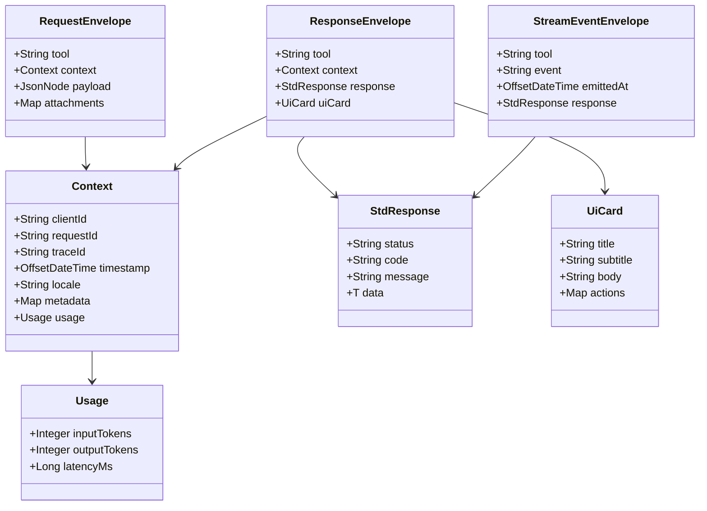

# MCP Template

## 项目定位
本仓库实现了一个完整的 Model Context Protocol（MCP）业务链路示例，展示了「模型客户端 ↔ MCP 工具服务端」的协同方式。代码采用多模块 Maven 结构，将共享协议、服务端工具编排、客户端运行时和 JSON Schema 分层管理，便于团队独立演进各个能力域。

```
root
├── mcp-common   # 协议与上下文模型（DTO、Envelope 等）
├── mcp-server   # Spring Boot 实现的 MCP 工具服务端
├── mcp-client   # 可配置的 Java MCP 客户端运行时
└── schema       # 统一的 JSON Schema 定义
```

## 业务架构总览
从业务视角看，MCP 模板围绕「请求编排 → 工具执行 → 结果回传」的闭环展开：

1. **渠道层（客户端运行时）**：负责接入外部触发（事件、API 调用或 SDK 集成），并将业务请求转换为标准化的 MCP Envelope。
2. **协议层（共享模型）**：`mcp-common` 输出上下文、请求、响应等标准模型，确保客户端与服务端在业务语义、鉴权信息、追踪标识上保持一致。【F:mcp-common/src/main/java/com/example/mcp/common/Context.java†L11-L124】【F:mcp-common/src/main/java/com/example/mcp/common/StdResponse.java†L8-L69】
3. **服务编排层（MCP 服务端）**：`mcp-server` 接收请求、完成鉴权与观测、路由到具体工具，并根据业务场景封装响应或卡片信息。【F:mcp-server/src/main/java/com/example/mcp/server/controller/McpController.java†L34-L111】
4. **工具能力层（工具处理器）**：每个业务工具实现 `ToolHandler` 接口，聚焦自身领域逻辑，例如翻译、问答、车机状态查询等，并在 `Context` 中沉淀用量指标供后续计费或分析。【F:mcp-server/src/main/java/com/example/mcp/server/handler/ToolHandler.java†L7-L12】【F:mcp-server/src/main/java/com/example/mcp/server/handler/VehicleStateGetHandler.java†L11-L76】

这种分层使 MCP 方案既能以最小改动嵌入现有业务系统，又能灵活扩展新的模型工具或渠道。

## 协议定义与设计
协议层通过统一的数据包结构让客户端与服务端在语义、鉴权、观测上对齐。以下类图描绘了核心 Envelope 模型的字段与引用关系：



* **上下文模型**：`Context` 与内部的 `Usage` 统一封装调用标识、追踪信息与消耗指标，是所有 Envelope 的必备元数据。【F:mcp-common/src/main/java/com/example/mcp/common/Context.java†L11-L124】
* **标准响应**：`StdResponse` 约定了跨工具的状态码、错误信息与泛型数据体，为服务端工具提供一致的返回包装。【F:mcp-common/src/main/java/com/example/mcp/common/StdResponse.java†L8-L69】
* **信封结构**：`Envelopes` 工具类定义了请求、响应、流式事件三种包装形态，并支持附带 UI 卡片、附件等扩展字段，确保不同传输协议仍共享统一语义。【F:mcp-common/src/main/java/com/example/mcp/common/Envelopes.java†L11-L226】
* **Schema 对齐**：`schema/mcp.schema.json` 将上述模型转化为 JSON Schema，明确字段类型、必填约束及不同工具的 Payload 结构，方便前后端、第三方在接口层面进行契约校验。【F:schema/mcp.schema.json†L1-L171】


## 服务端业务视角
服务端以 Spring Boot 启动 `McpServerApplication`，暴露 `/mcp/invoke`（处理工具调用）与 `/mcp/stream`（推送流式事件）两个核心入口。【F:mcp-server/src/main/java/com/example/mcp/server/McpServerApplication.java†L1-L11】【F:mcp-server/src/main/java/com/example/mcp/server/controller/McpController.java†L34-L111】

* **统一鉴权**：`HmacAuthFilter` 校验客户端基于共享密钥生成的 HMAC 签名，确保所有业务调用具备来源可信度。【F:mcp-server/src/main/java/com/example/mcp/server/security/HmacAuthFilter.java†L21-L101】
* **全链路追踪**：`TracingFilter` 将 HTTP 请求与 OpenTelemetry span 关联，把 clientId、toolName 等标签沉淀，支撑故障追踪与 SLA 分析。【F:mcp-server/src/main/java/com/example/mcp/server/tracing/TracingFilter.java†L21-L79】
* **工具编排**：`McpController` 基于 `ToolRegistry` 查找业务工具，完成请求模型转换、上下文补全、卡片渲染与 SSE 心跳发送，实现对多种业务能力的统一编排。【F:mcp-server/src/main/java/com/example/mcp/server/controller/McpController.java†L42-L108】
* **领域工具**：`TranslationInvokeHandler`、`VehicleStateGetHandler` 等处理器专注于领域逻辑：读取业务参数、模拟外部系统查询、封装 `StdResponse` 并回写到上下文，形成可扩展的工具目录。【F:mcp-server/src/main/java/com/example/mcp/server/handler/TranslationInvokeHandler.java†L11-L63】【F:mcp-server/src/main/java/com/example/mcp/server/handler/VehicleStateGetHandler.java†L11-L76】

## 客户端业务视角
客户端扮演渠道聚合与调用编排角色：

* **核心调用器**：`McpClient` 负责将业务事件封装为 `RequestEnvelope`、注入追踪上下文，并解析标准响应。它同时支持同步调用、异步 Future、SSE 订阅等模式，满足多终端需求。【F:mcp-client/src/main/java/com/example/mcp/client/McpClient.java†L21-L119】
* **多样化传输**：通过 `Transport` 接口抽象 HTTP、gRPC、SDK 等协议，实现对不同服务部署形态的无感切换。`HttpTransport`、`GrpcTransport`、`SdkTransport` 分别对应企业常见的网络形态。【F:mcp-client/src/main/java/com/example/mcp/client/transport/Transport.java†L1-L32】【F:mcp-client/src/main/java/com/example/mcp/client/transport/HttpTransport.java†L17-L71】【F:mcp-client/src/main/java/com/example/mcp/client/transport/GrpcTransport.java†L17-L86】【F:mcp-client/src/main/java/com/example/mcp/client/transport/SdkTransport.java†L7-L47】
* **安全与观测扩展**：客户端侧的 `HmacAuthInterceptor`、`TraceInterceptor` 通过 OkHttp 拦截器注入签名与链路标识，使每一次工具调用都可定位、可审计。【F:mcp-client/src/main/java/com/example/mcp/client/interceptor/HmacAuthInterceptor.java†L13-L61】【F:mcp-client/src/main/java/com/example/mcp/client/interceptor/TraceInterceptor.java†L15-L43】
* **配置驱动路由**：`McpClientConfig`/`TransportFactory` 以 JSON 配置描述可用服务、路由规则和需要挂载的拦截器；`McpClientEnvironment` + `McpRouteDispatcher` 则根据配置监听事件、分发至指定工具，形成高度可配置的编排引擎。【F:mcp-client/src/main/java/com/example/mcp/client/config/McpClientConfig.java†L1-L52】【F:mcp-client/src/main/java/com/example/mcp/client/config/TransportFactory.java†L1-L92】【F:mcp-client/src/main/java/com/example/mcp/client/runtime/McpClientEnvironment.java†L1-L43】【F:mcp-client/src/main/java/com/example/mcp/client/runtime/McpRouteDispatcher.java†L1-L132】
* **示例流程**：`ClientDemo` 演示如何读取配置、注册路由并调用 `vehicleState` 工具，帮助业务方快速验证整条链路。【F:mcp-client/src/main/java/com/example/mcp/client/demo/ClientDemo.java†L1-L46】

## 端到端业务流程
以下流程串联起业务调用的关键触点：

1. 渠道方（如对话系统）通过 `McpRouteClient` 发布 `vehicleState.request` 等事件，请求上下文带有 clientId、traceId 等业务标识。【F:mcp-client/src/main/java/com/example/mcp/client/runtime/McpRouteClient.java†L1-L94】
2. `McpRouteDispatcher` 根据配置选择目标服务器与传输协议，完成请求模型转换后调用 `McpClient` 发起工具执行。【F:mcp-client/src/main/java/com/example/mcp/client/runtime/McpRouteDispatcher.java†L55-L132】
3. 服务端 `McpController` 校验签名、记录追踪信息，并委派给匹配的 `ToolHandler` 执行业务逻辑，产出标准化的 `StdResponse`。【F:mcp-server/src/main/java/com/example/mcp/server/controller/McpController.java†L60-L108】
4. 响应封装成 `Envelopes.ResponseEnvelope`，必要时通过 `Envelopes.StreamEventEnvelope` 推送 UI 卡片或增量事件，经由选定的传输（HTTP/gRPC/SDK）返回给客户端。【F:mcp-common/src/main/java/com/example/mcp/common/Envelopes.java†L61-L153】
5. 客户端收到响应后向事件总线发布 `*.response`，消费者可以同步等待结果或订阅 SSE 以接收持续更新，形成自闭环反馈。【F:mcp-client/src/main/java/com/example/mcp/client/event/McpEventBus.java†L1-L49】

通过上述链路，团队可以在不改变原有业务系统的前提下，快速插入新的模型工具能力，并确保鉴权、追踪、配置等横切需求一次构建、全局复用。
