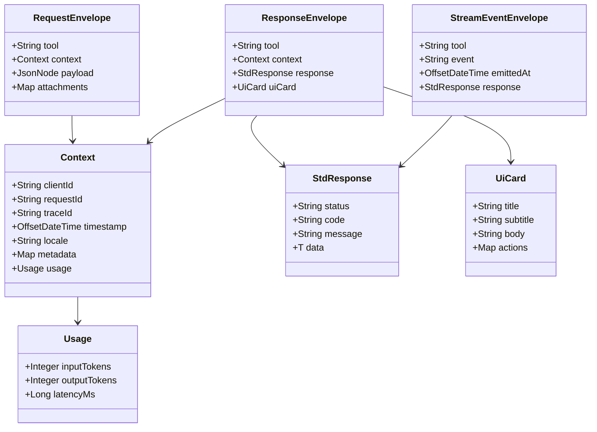

# MCP Template

> This README now ships with bilingual sections. The English portion keeps downstream documentation in sync, while the Chinese portion保留原有的业务解读，避免在不同分支上维护多份冲突内容。

- [English Overview](#english-overview)
- [中文概览](#中文概览)

## English Overview

### Project Scope
This repository demonstrates an end-to-end Model Context Protocol (MCP) workflow that spans the model-facing client runtime and the Spring Boot tool server. The multi-module Maven layout isolates shared contracts, server orchestration, client runtime, and JSON Schema definitions so that individual teams can evolve capabilities independently.【F:mcp-common/src/main/java/com/example/mcp/common/Context.java†L11-L124】【F:mcp-server/src/main/java/com/example/mcp/server/controller/McpController.java†L34-L111】【F:mcp-client/src/main/java/com/example/mcp/client/McpClient.java†L21-L119】

```
root
├── mcp-common   # DTOs, envelopes, shared context
├── mcp-server   # Spring Boot MCP tool server
├── mcp-client   # Configurable Java MCP client runtime
└── schema       # Unified JSON Schema contracts
```

### Architecture Layers
The solution revolves around a closed loop of **request orchestration → tool execution → response delivery**:

1. **Client runtime** accepts triggers from channels, SDKs, or APIs and converts them into normalized MCP envelopes.【F:mcp-client/src/main/java/com/example/mcp/client/runtime/McpRouteDispatcher.java†L1-L132】
2. **Shared protocol** lives in `mcp-common`, defining the context, request, and response shapes that keep semantics, authentication, and tracing metadata aligned across tiers.【F:mcp-common/src/main/java/com/example/mcp/common/Context.java†L11-L124】【F:mcp-common/src/main/java/com/example/mcp/common/StdResponse.java†L8-L69】
3. **Server orchestration** inside `mcp-server` validates signatures, records telemetry, routes to the correct tool handler, and prepares responses or UI cards.【F:mcp-server/src/main/java/com/example/mcp/server/controller/McpController.java†L34-L111】
4. **Tool capabilities** implement `ToolHandler`, focusing on domain logic such as translation or vehicle state lookup while updating usage metrics back into the context.【F:mcp-server/src/main/java/com/example/mcp/server/handler/ToolHandler.java†L7-L12】【F:mcp-server/src/main/java/com/example/mcp/server/handler/VehicleStateGetHandler.java†L11-L76】

This layered split lets teams plug MCP into existing systems with minimal change while still scaling to new tools or channels.

### Protocol Design Snapshot
The protocol ensures client and server stay in sync through unified envelopes. The Mermaid diagram below summarizes the key types used across the stack:



- `Context` and `Usage` capture traceability, locale, metadata, and consumption metrics across the entire workflow.【F:mcp-common/src/main/java/com/example/mcp/common/Context.java†L11-L124】
- `StdResponse` unifies status, error codes, and payload, guaranteeing consistent response packaging for every tool.【F:mcp-common/src/main/java/com/example/mcp/common/StdResponse.java†L8-L69】
- `Envelopes` expose request, response, and streaming variants while supporting UI cards and attachments so that transport implementations stay semantic-aligned.【F:mcp-common/src/main/java/com/example/mcp/common/Envelopes.java†L11-L226】
- `schema/mcp.schema.json` maps these models into JSON Schema, defining required properties and tool-specific payload contracts for validation on both ends.【F:schema/mcp.schema.json†L1-L171】

### Embedded MCP Protocol Manual
> The following accordion embeds the canonical reference hosted in [docs/mcp-protocol.md](docs/mcp-protocol.md), making the README self-contained for reviewers.

<details open>
<summary>Expand MCP protocol quick reference</summary>

<!-- MCP_PROTOCOL:START -->

# MCP 协议参考

本文聚焦 Model Context Protocol（MCP）本身的约定与数据结构，帮助读者在没有具体代码背景的情况下理解协议如何组织一次工具调用的生命周期。

## 协议参与方
- **模型客户端（Model Runtime）**：代表模型或上游应用，负责发起工具调用、订阅事件流、对响应做语义理解。
- **工具服务端（Tool Server）**：承接模型请求，完成鉴权、调度具体工具，并将结果封装成标准响应。
- **共享契约层（Contracts）**：约定上下文字段、数据包形态与错误语义，确保任意客户端与服务端都能按统一格式通信。

## 调用上下文
所有请求都通过 `Context` 携带调用标识与运行时元数据：

- `clientId`、`requestId`、`traceId`：用于追踪、去重与链路串联。
- `timestamp`：ISO-8601 时间戳，保证参与方在时序上的一致性。
- `locale`、`metadata`：面向多语言、多租户等扩展场景的开放字段。
- `usage`：记录 token、延迟等消耗指标，可供计费或 SLA 评估。

客户端在发起请求时写入上述信息，服务端在响应中补充或更新 `usage` 等指标，形成端到端透传。

## Envelope 形态
MCP 通过统一的 Envelope 抽象不同阶段的消息：

- **RequestEnvelope**：封装 `tool` 名称、`Context` 与结构化 `payload`，代表一次工具调用的输入。
- **ResponseEnvelope**：携带 `StdResponse` 与可选的 `UiCard`，用于返回最终结果及界面展示数据。
- **StreamEventEnvelope**：面向长任务或实时推送，包含事件类型、时间戳以及阶段性响应内容。

这些 Envelope 保持字段一致，使 HTTP、gRPC、WebSocket 等传输层可以复用相同的序列化结构。

## 方法族与交互流程
MCP 将交互拆分为一组方法族：

1. `list_tools`：客户端发现工具能力与参数签名。
2. `call_tool`：提交结构化负载，请求执行指定工具。
3. `stream_events`：订阅工具执行过程中的增量事件或心跳。
4. `cancel_call`：在需要时撤销长时间运行的调用。

以翻译或车控场景为例：

- 客户端先调用 `list_tools` 获知 `translation`、`vehicleState` 等工具支持的字段与语言范围。
- 调用 `call_tool` 时，`payload` 中携带翻译的源文本、目标语言，或车辆 VIN、查询参数等业务信息。
- 若工具执行耗时，服务端可通过 `stream_events` 推送阶段性状态（如“翻译进度 50%”、“车辆状态读取中”），最终由 `ResponseEnvelope` 给出完整结果或 UI 卡片。

## JSON Schema 契约
协议推荐使用 JSON Schema 描述工具的入参、出参：

- 公共部分定义 `Context`、`Usage`、`StdResponse` 等基础组件。
- 每个工具声明自身 `payload` 的必填字段、类型范围和枚举值（例如翻译的语言代码、车控的控制指令列表）。
- Schema 可被客户端用于本地校验，也可在服务端对入参做二次验证，确保双方对契约达成共识。

## UI 卡片与展示
`UiCard` 对象封装标题、副标题、正文和交互动作，便于将 MCP 响应直接映射到前端或车载屏幕。例如：

- 翻译结果卡片可以展示源文本、译文以及“复制”操作。
- 车控查询卡片可罗列车辆状态、剩余续航，并附带“刷新”“预约保养”等动作。

## 错误语义与幂等
`StdResponse` 通过 `status`、`code`、`message`、`data` 四个字段表达结果：

- `status` 区分 `SUCCESS`、`FAILED`、`PROCESSING` 等状态。
- `code` 承载业务错误码，便于客户端根据语义采取补偿措施。
- `message` 面向人类可读说明，`data` 存放结构化结果或错误细节。

协议鼓励将 `requestId` 作为幂等键；若客户端重复发送同一请求，服务端可直接返回已缓存的响应，减少重复计算。

## 鉴权与观测
MCP 不强制某种安全方案，但推荐：

- 在 `Context.metadata` 中附带签名信息或租户标识，实现自定义鉴权。
- 使用开放式追踪 ID（如 W3C Trace Context）串联调用链路。
- 将 `usage` 与事件时间戳写回响应，以便观测平台统计性能与成功率。

通过以上约定，任意模型客户端都能在不共享内部实现细节的情况下，与不同领域的工具（翻译、车控、知识库等）建立稳定、可演进的集成关系。

<!-- MCP_PROTOCOL:END -->

</details>

### Server Perspective
`McpServerApplication` exposes `/mcp/invoke` for tool execution and `/mcp/stream` for streaming events, building on Spring Boot for dependency injection and observability.【F:mcp-server/src/main/java/com/example/mcp/server/McpServerApplication.java†L1-L11】【F:mcp-server/src/main/java/com/example/mcp/server/controller/McpController.java†L34-L111】

- `HmacAuthFilter` validates HMAC signatures generated by clients to guarantee request integrity.【F:mcp-server/src/main/java/com/example/mcp/server/security/HmacAuthFilter.java†L21-L101】
- `TracingFilter` links incoming HTTP calls with OpenTelemetry spans, recording tags like clientId and tool name for SLA insights.【F:mcp-server/src/main/java/com/example/mcp/server/tracing/TracingFilter.java†L21-L79】
- `McpController` looks up tool handlers via `ToolRegistry`, enriches context, and emits UI cards or SSE heartbeats as needed.【F:mcp-server/src/main/java/com/example/mcp/server/controller/McpController.java†L42-L108】
- Domain handlers such as `TranslationInvokeHandler` and `VehicleStateGetHandler` encapsulate business logic, returning standardized `StdResponse` payloads and updating context usage.【F:mcp-server/src/main/java/com/example/mcp/server/handler/TranslationInvokeHandler.java†L11-L63】【F:mcp-server/src/main/java/com/example/mcp/server/handler/VehicleStateGetHandler.java†L11-L76】

### Client Perspective
The client runtime orchestrates channel inputs and tool invocations:

- `McpClient` wraps business events into `RequestEnvelope`, injects tracing metadata, and parses standardized responses across sync, async, and SSE flows.【F:mcp-client/src/main/java/com/example/mcp/client/McpClient.java†L21-L119】
- Transport implementations (`HttpTransport`, `GrpcTransport`, `SdkTransport`) hide protocol differences behind a common interface for deployment flexibility.【F:mcp-client/src/main/java/com/example/mcp/client/transport/Transport.java†L1-L32】【F:mcp-client/src/main/java/com/example/mcp/client/transport/HttpTransport.java†L17-L71】【F:mcp-client/src/main/java/com/example/mcp/client/transport/GrpcTransport.java†L17-L86】【F:mcp-client/src/main/java/com/example/mcp/client/transport/SdkTransport.java†L7-L47】
- `HmacAuthInterceptor` and `TraceInterceptor` enrich outbound calls with signatures and trace identifiers for secure, observable execution.【F:mcp-client/src/main/java/com/example/mcp/client/interceptor/HmacAuthInterceptor.java†L13-L61】【F:mcp-client/src/main/java/com/example/mcp/client/interceptor/TraceInterceptor.java†L15-L43】
- `McpClientConfig`, `TransportFactory`, `McpClientEnvironment`, and `McpRouteDispatcher` build a configuration-driven routing layer that reacts to events and dispatches them to the proper tool.【F:mcp-client/src/main/java/com/example/mcp/client/config/McpClientConfig.java†L1-L52】【F:mcp-client/src/main/java/com/example/mcp/client/config/TransportFactory.java†L1-L92】【F:mcp-client/src/main/java/com/example/mcp/client/runtime/McpClientEnvironment.java†L1-L43】【F:mcp-client/src/main/java/com/example/mcp/client/runtime/McpRouteDispatcher.java†L1-L132】
- `ClientDemo` illustrates how to bootstrap the runtime, register routes, and invoke the `vehicleState` tool end to end.【F:mcp-client/src/main/java/com/example/mcp/client/demo/ClientDemo.java†L1-L46】

### End-to-End Flow
1. Channels publish events such as `vehicleState.request` through `McpRouteClient`, carrying client, tenant, and trace identifiers in the context.【F:mcp-client/src/main/java/com/example/mcp/client/runtime/McpRouteClient.java†L1-L94】
2. `McpRouteDispatcher` resolves the configured transport, converts the event into a `RequestEnvelope`, and calls `McpClient` to execute the tool.【F:mcp-client/src/main/java/com/example/mcp/client/runtime/McpRouteDispatcher.java†L55-L132】
3. `McpController` validates signatures, records tracing, and forwards execution to the designated `ToolHandler`, which returns a standardized `StdResponse`.【F:mcp-server/src/main/java/com/example/mcp/server/controller/McpController.java†L60-L108】
4. Responses become `Envelopes.ResponseEnvelope`; optional `StreamEventEnvelope` messages carry incremental updates or UI cards across HTTP, gRPC, or SDK transports.【F:mcp-common/src/main/java/com/example/mcp/common/Envelopes.java†L61-L153】
5. The client publishes `*.response` events to `McpEventBus`, letting consumers wait synchronously or subscribe to SSE streams for continuous updates.【F:mcp-client/src/main/java/com/example/mcp/client/event/McpEventBus.java†L1-L49】


### Applying MCP Protocol to Translation & Vehicle Control
Translation and vehicle tools share the same MCP envelopes; the differentiation lives in the tool names, payload schema, and handler logic. The following touchpoints illustrate how the protocol binds everything together:

- **Schema alignment**: `schema/mcp.schema.json` declares request/response shapes for `mcp.translation.invoke` and `mcp.vehicle.state.get`, so both client and server know which fields (languages, vehicleId, coordinates) belong in the payloads.【F:schema/mcp.schema.json†L60-L158】
- **Tool execution**: `TranslationInvokeHandler` and `VehicleStateGetHandler` implement the domain behaviors behind those tool names while updating `Context.Usage`, allowing the protocol to surface translation text or vehicle telematics without altering envelope structure.【F:mcp-server/src/main/java/com/example/mcp/server/handler/TranslationInvokeHandler.java†L8-L102】【F:mcp-server/src/main/java/com/example/mcp/server/handler/VehicleStateGetHandler.java†L8-L95】
- **Response packaging**: `McpController` routes incoming envelopes to the correct handler and, for translation, attaches a UI card so UI channels can render the result directly from the protocol response.【F:mcp-server/src/main/java/com/example/mcp/server/controller/McpController.java†L40-L113】
- **Client orchestration**: `McpRouteDispatcher` listens for channel events (for example, `translation.request` or `vehicleState.request`) and invokes the appropriate tool via `McpClient`, ensuring every call respects the same request/response contract.【F:mcp-client/src/main/java/com/example/mcp/client/runtime/McpRouteDispatcher.java†L37-L90】【F:mcp-client/src/main/java/com/example/mcp/client/McpClient.java†L42-L107】

## 中文概览

### 项目定位
本仓库实现了一个完整的 Model Context Protocol（MCP）业务链路示例，展示了「模型客户端 ↔ MCP 工具服务端」的协同方式。代码采用多模块 Maven 结构，将共享协议、服务端工具编排、客户端运行时和 JSON Schema 分层管理，便于团队独立演进各个能力域。【F:mcp-common/src/main/java/com/example/mcp/common/Context.java†L11-L124】【F:mcp-server/src/main/java/com/example/mcp/server/controller/McpController.java†L34-L111】【F:mcp-client/src/main/java/com/example/mcp/client/McpClient.java†L21-L119】

```
root
├── mcp-common   # 协议与上下文模型（DTO、Envelope 等）
├── mcp-server   # Spring Boot 实现的 MCP 工具服务端
├── mcp-client   # 可配置的 Java MCP 客户端运行时
└── schema       # 统一的 JSON Schema 定义
```

### 业务架构总览
从业务视角看，MCP 模板围绕「请求编排 → 工具执行 → 结果回传」的闭环展开：

1. **渠道层（客户端运行时）**：负责接入外部触发（事件、API 调用或 SDK 集成），并将业务请求转换为标准化的 MCP Envelope。【F:mcp-client/src/main/java/com/example/mcp/client/runtime/McpRouteDispatcher.java†L1-L132】
2. **协议层（共享模型）**：`mcp-common` 输出上下文、请求、响应等标准模型，确保客户端与服务端在业务语义、鉴权信息、追踪标识上保持一致。【F:mcp-common/src/main/java/com/example/mcp/common/Context.java†L11-L124】【F:mcp-common/src/main/java/com/example/mcp/common/StdResponse.java†L8-L69】
3. **服务编排层（MCP 服务端）**：`mcp-server` 接收请求、完成鉴权与观测、路由到具体工具，并根据业务场景封装响应或卡片信息。【F:mcp-server/src/main/java/com/example/mcp/server/controller/McpController.java†L34-L111】
4. **工具能力层（工具处理器）**：每个业务工具实现 `ToolHandler` 接口，聚焦自身领域逻辑，并在 `Context` 中沉淀用量指标供后续计费或分析。【F:mcp-server/src/main/java/com/example/mcp/server/handler/ToolHandler.java†L7-L12】【F:mcp-server/src/main/java/com/example/mcp/server/handler/VehicleStateGetHandler.java†L11-L76】

### 协议定义与设计
协议层通过统一的数据包结构让客户端与服务端在语义、鉴权、观测上对齐。以下类图描绘了核心 Envelope 模型的字段与引用关系：


* **上下文模型**：`Context` 与内部的 `Usage` 统一封装调用标识、追踪信息与消耗指标，是所有 Envelope 的必备元数据。【F:mcp-common/src/main/java/com/example/mcp/common/Context.java†L11-L124】
* **标准响应**：`StdResponse` 约定了跨工具的状态码、错误信息与泛型数据体，为服务端工具提供一致的返回包装。【F:mcp-common/src/main/java/com/example/mcp/common/StdResponse.java†L8-L69】
* **信封结构**：`Envelopes` 工具类定义了请求、响应、流式事件三种包装形态，并支持附带 UI 卡片、附件等扩展字段，确保不同传输协议仍共享统一语义。【F:mcp-common/src/main/java/com/example/mcp/common/Envelopes.java†L11-L226】
* **Schema 对齐**：`schema/mcp.schema.json` 将上述模型转化为 JSON Schema，明确字段类型、必填约束及不同工具的 Payload 结构，方便前后端、第三方在接口层面进行契约校验。【F:schema/mcp.schema.json†L1-L171】

### MCP 协议参考手册（嵌入）

> 协议条目请直接参考前文的「Embedded MCP Protocol Manual」章节，或访问 [docs/mcp-protocol.md](docs/mcp-protocol.md) 获取完整副本。

### 服务端业务视角
服务端以 Spring Boot 启动 `McpServerApplication`，暴露 `/mcp/invoke`（处理工具调用）与 `/mcp/stream`（推送流式事件）两个核心入口。【F:mcp-server/src/main/java/com/example/mcp/server/McpServerApplication.java†L1-L11】【F:mcp-server/src/main/java/com/example/mcp/server/controller/McpController.java†L34-L111】

* **统一鉴权**：`HmacAuthFilter` 校验客户端基于共享密钥生成的 HMAC 签名，确保所有业务调用具备来源可信度。【F:mcp-server/src/main/java/com/example/mcp/server/security/HmacAuthFilter.java†L21-L101】
* **全链路追踪**：`TracingFilter` 将 HTTP 请求与 OpenTelemetry span 关联，把 clientId、toolName 等标签沉淀，支撑故障追踪与 SLA 分析。【F:mcp-server/src/main/java/com/example/mcp/server/tracing/TracingFilter.java†L21-L79】
* **工具编排**：`McpController` 基于 `ToolRegistry` 查找业务工具，完成请求模型转换、上下文补全、卡片渲染与 SSE 心跳发送，实现对多种业务能力的统一编排。【F:mcp-server/src/main/java/com/example/mcp/server/controller/McpController.java†L42-L108】
* **领域工具**：`TranslationInvokeHandler`、`VehicleStateGetHandler` 等处理器专注于领域逻辑：读取业务参数、模拟外部系统查询、封装 `StdResponse` 并回写到上下文，形成可扩展的工具目录。【F:mcp-server/src/main/java/com/example/mcp/server/handler/TranslationInvokeHandler.java†L11-L63】【F:mcp-server/src/main/java/com/example/mcp/server/handler/VehicleStateGetHandler.java†L11-L76】

### 客户端业务视角
客户端扮演渠道聚合与调用编排角色：

* **核心调用器**：`McpClient` 负责将业务事件封装为 `RequestEnvelope`、注入追踪上下文，并解析标准响应。它同时支持同步调用、异步 Future、SSE 订阅等模式，满足多终端需求。【F:mcp-client/src/main/java/com/example/mcp/client/McpClient.java†L21-L119】
* **多样化传输**：通过 `Transport` 接口抽象 HTTP、gRPC、SDK 等协议，实现对不同服务部署形态的无感切换。`HttpTransport`、`GrpcTransport`、`SdkTransport` 分别对应企业常见的网络形态。【F:mcp-client/src/main/java/com/example/mcp/client/transport/Transport.java†L1-L32】【F:mcp-client/src/main/java/com/example/mcp/client/transport/HttpTransport.java†L17-L71】【F:mcp-client/src/main/java/com/example/mcp/client/transport/GrpcTransport.java†L17-L86】【F:mcp-client/src/main/java/com/example/mcp/client/transport/SdkTransport.java†L7-L47】
* **安全与观测扩展**：客户端侧的 `HmacAuthInterceptor`、`TraceInterceptor` 通过 OkHttp 拦截器注入签名与链路标识，使每一次工具调用都可定位、可审计。【F:mcp-client/src/main/java/com/example/mcp/client/interceptor/HmacAuthInterceptor.java†L13-L61】【F:mcp-client/src/main/java/com/example/mcp/client/interceptor/TraceInterceptor.java†L15-L43】
* **配置驱动路由**：`McpClientConfig`/`TransportFactory` 以 JSON 配置描述可用服务、路由规则和需要挂载的拦截器；`McpClientEnvironment` + `McpRouteDispatcher` 则根据配置监听事件、分发至指定工具，形成高度可配置的编排引擎。【F:mcp-client/src/main/java/com/example/mcp/client/config/McpClientConfig.java†L1-L52】【F:mcp-client/src/main/java/com/example/mcp/client/config/TransportFactory.java†L1-L92】【F:mcp-client/src/main/java/com/example/mcp/client/runtime/McpClientEnvironment.java†L1-L43】【F:mcp-client/src/main/java/com/example/mcp/client/runtime/McpRouteDispatcher.java†L1-L132】
* **示例流程**：`ClientDemo` 演示如何读取配置、注册路由并调用 `vehicleState` 工具，帮助业务方快速验证整条链路。【F:mcp-client/src/main/java/com/example/mcp/client/demo/ClientDemo.java†L1-L46】

### 端到端业务流程
以下流程串联起业务调用的关键触点：

1. 渠道方（如对话系统）通过 `McpRouteClient` 发布 `vehicleState.request` 等事件，请求上下文带有 clientId、traceId 等业务标识。【F:mcp-client/src/main/java/com/example/mcp/client/runtime/McpRouteClient.java†L1-L94】
2. `McpRouteDispatcher` 根据配置选择目标服务器传输协议，完成请求模型转换后调用 `McpClient` 发起工具执行。【F:mcp-client/src/main/java/com/example/mcp/client/runtime/McpRouteDispatcher.java†L55-L132】
3. 服务端 `McpController` 校验签名、记录追踪信息，并委派给匹配的 `ToolHandler` 执行业务逻辑，产出标准化的 `StdResponse`。【F:mcp-server/src/main/java/com/example/mcp/server/controller/McpController.java†L60-L108】
4. 响应封装成 `Envelopes.ResponseEnvelope`，必要时通过 `Envelopes.StreamEventEnvelope` 推送 UI 卡片或增量事件，经由选定的传输（HTTP/gRPC/SDK）返回给客户端。【F:mcp-common/src/main/java/com/example/mcp/common/Envelopes.java†L61-L153】
5. 客户端收到响应后向事件总线发布 `*.response`，消费者可以同步等待结果或订阅 SSE 以接收持续更新，形成自闭环反馈。【F:mcp-client/src/main/java/com/example/mcp/client/event/McpEventBus.java†L1-L49】

### MCP 协议在翻译与车控场景中的落地
翻译与车控工具共享同一套 MCP Envelope，只在工具名、Schema 与处理器逻辑上进行差异化。结合模板代码，可以看到协议如何把领域能力串联起来：

- **Schema 契约**：`schema/mcp.schema.json` 为 `mcp.translation.invoke` 与 `mcp.vehicle.state.get` 声明入参、出参结构，约束语言代码、车辆标识等字段在 payload 中的形态，保证前后端理解一致。【F:schema/mcp.schema.json†L60-L158】
- **工具执行**：`TranslationInvokeHandler` 与 `VehicleStateGetHandler` 按工具名实现翻译与车辆状态查询，同时回写 `Context.Usage`，让协议层无需改变即可承载领域数据。【F:mcp-server/src/main/java/com/example/mcp/server/handler/TranslationInvokeHandler.java†L8-L102】【F:mcp-server/src/main/java/com/example/mcp/server/handler/VehicleStateGetHandler.java†L8-L95】
- **响应封装**：`McpController` 依据 Envelope 中的 tool 字段路由到对应处理器，并在翻译场景附带 UI 卡片，方便前端直接渲染协议返回的结果。【F:mcp-server/src/main/java/com/example/mcp/server/controller/McpController.java†L40-L113】
- **客户端编排**：`McpRouteDispatcher` 监听 `translation.request`、`vehicleState.request` 等事件，经由 `McpClient` 发起工具调用，让所有场景遵循同一套请求/响应契约。【F:mcp-client/src/main/java/com/example/mcp/client/runtime/McpRouteDispatcher.java†L37-L90】【F:mcp-client/src/main/java/com/example/mcp/client/McpClient.java†L42-L107】

通过上述链路，团队可以在不改变原有业务系统的前提下，快速插入新的模型工具能力，并确保鉴权、追踪、配置等横切需求一次构建、全局复用。
